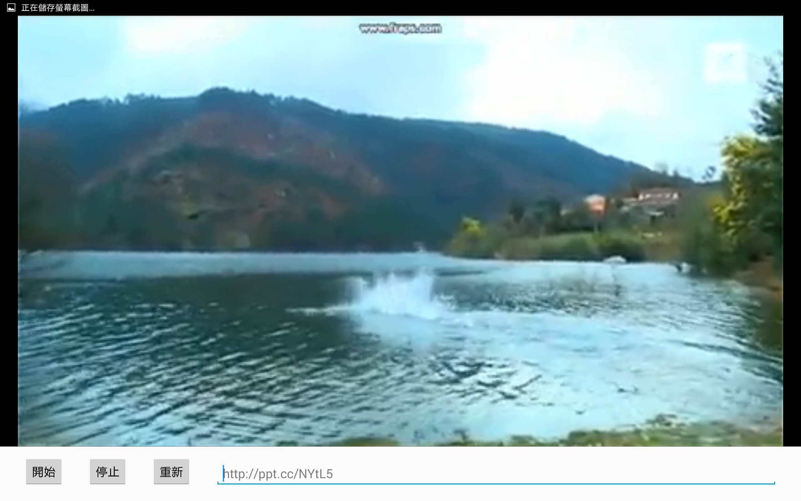

#VLC Player

#### Development Environment
- Windows 7 SP1
- Android Studio 1.4

#### Built Environment
- 開啟 Android Studio

- 建立新的 App 叫做 AndroidVLCPlayer

- 下載 VLC Player 的 Library
https://github.com/xiaomo/AndroidPlayerLibrary

- 將 Library 匯入專案
 


- 選擇 Library 的 資料夾匯入


- 通常選下一步直到完成即可 


- 開啟 playerLibrary 的 build.gradle：
    - 將 apply plugin: 'com.android.application' 修改為 apply plugin: 'com.android.library'
    - 將 applicationId 刪除
    - 例如 :

```gradle
apply plugin: 'com.android.library'
android {
    compileSdkVersion 21
    buildToolsVersion "19.1.0"

    defaultConfig {
        //applicationId "com.mediedictionary.playerlibrary"
        minSdkVersion 8
        targetSdkVersion 21
    }

    buildTypes {
        release {
            minifyEnabled false
            proguardFiles getDefaultProguardFile('proguard-android.txt'), 'proguard-rules.txt'
        }
    }
}

dependencies {
    compile 'com.android.support:support-v4:21.+'
}

```
- 接著將 Library 加入專案裡面
-
 


    
-  環境及 Library 至此建立完成


#### The Simplest Sample
- 建立 MainLayout ， 如下範例 :  

```java
public class MainLayout extends RelativeLayout {
    // 使用 Library 提供的 PlayerView 元件
    public PlayerView playerView;
    public Button startButton;
    public Button stopButton;
    public Button restartButton;
    public EditText inpoutUrlEditText;
    private WH ruler;

    public MainLayout(Context context) {
        super(context);
        ruler = new WH(getContext());

        playerView = setPlayerView();
        startButton = setStartButton();
        stopButton = setStopButton();
        restartButton = setRestartButton();
        inpoutUrlEditText = setInpoutUrlEditText();

        addView(playerView);
        addView(startButton);
        addView(restartButton);
        addView(stopButton);
        addView(inpoutUrlEditText);
    }

    private PlayerView setPlayerView() {
        RelativeLayout.LayoutParams params = new RelativeLayout.LayoutParams(
                RelativeLayout.LayoutParams.MATCH_PARENT,
                ruler.getH(86)
        );
        params.addRule(ALIGN_PARENT_TOP);

        PlayerView v = new PlayerView(getContext());
        v.setId(GenerateViewId.get());
        v.setLayoutParams(params);
        return v;
    }

    private Button setStartButton() {
        RelativeLayout.LayoutParams params = new RelativeLayout.LayoutParams(
                LayoutParams.WRAP_CONTENT,
                LayoutParams.WRAP_CONTENT
        );
        params.addRule(BELOW, playerView.getId());
        params.setMargins(ruler.getW(3), ruler.getH(2), 0, 0);

        Button v = new Button(getContext());
        v.setId(GenerateViewId.get());
        v.setLayoutParams(params);
        v.setText(getResources().getString(R.string.start_button));
        v.setTextSize(TypedValue.COMPLEX_UNIT_PX, ruler.getTextSize(40));
        return v;
    }

    private Button setStopButton() {
        RelativeLayout.LayoutParams params = new RelativeLayout.LayoutParams(
                LayoutParams.WRAP_CONTENT,
                LayoutParams.WRAP_CONTENT
        );
        params.addRule(ALIGN_BOTTOM, startButton.getId());
        params.addRule(RIGHT_OF, startButton.getId());
        params.setMargins(ruler.getW(3), 0, 0, 0);

        Button v = new Button(getContext());
        v.setId(GenerateViewId.get());
        v.setLayoutParams(params);
        v.setText(getResources().getString(R.string.stop_button));
        v.setTextSize(TypedValue.COMPLEX_UNIT_PX, ruler.getTextSize(40));
        return v;
    }

    private Button setRestartButton() {
        RelativeLayout.LayoutParams params = new RelativeLayout.LayoutParams(
                LayoutParams.WRAP_CONTENT,
                LayoutParams.WRAP_CONTENT
        );
        params.addRule(ALIGN_BOTTOM, startButton.getId());
        params.addRule(RIGHT_OF, stopButton.getId());
        params.setMargins(ruler.getW(3), 0, 0, 0);

        Button v = new Button(getContext());
        v.setId(GenerateViewId.get());
        v.setLayoutParams(params);
        v.setText(getResources().getString(R.string.restart_button));
        v.setTextSize(TypedValue.COMPLEX_UNIT_PX, ruler.getTextSize(40));
        return v;
    }

    private EditText setInpoutUrlEditText() {
        RelativeLayout.LayoutParams params = new RelativeLayout.LayoutParams(
                LayoutParams.MATCH_PARENT,
                LayoutParams.WRAP_CONTENT
        );
        params.addRule(ALIGN_BOTTOM, startButton.getId());
        params.addRule(RIGHT_OF, restartButton.getId());
        params.setMargins(ruler.getW(3), 0, ruler.getW(3), 0);

        EditText v = new EditText(getContext());
        v.setId(GenerateViewId.get());
        v.setLayoutParams(params);
        v.setHint(getResources().getString(R.string.inpout_url_edittext));
        v.setTextSize(TypedValue.COMPLEX_UNIT_PX, ruler.getTextSize(40));
        return v;
    }

}

```
- 修改 MainActivity ， 如下範例 : 

```JAVA
public class MainActivity extends Activity {
    private MainLayout layout;

    // 顯示 Buffer 進度的 Snackbar
    private Snackbar showBufferSnackbar;

    // 設定 暫停/繼續 的狀態
    private boolean isPause = false;

    // 設定當前播放的時間
    private long time;

    @Override
    protected void onCreate(Bundle savedInstanceState) {
        super.onCreate(savedInstanceState);
        setContentView(layout = new MainLayout(this));

        layout.playerView.setOnChangeListener(changeListener);
        layout.startButton.setOnClickListener(startClick);
        layout.restartButton.setOnClickListener(restartClick);
        layout.stopButton.setOnClickListener(stopClick);
    }

    // 設定 PlayerView 基本參數
    private void initPlayerView() {
        // 設定網路快取的參數 ( 以毫秒為單位 )
        layout.playerView.setNetWorkCache(20000);

        // 設定影片的網址及初始化播放器 ( 網址必須為資料的位置 Ex:xxxx.xxxx/xxxxx/xxx.mp4 )
        if (layout.inpoutUrlEditText.getText().toString().equals("")) {
            // 使用預設的網址為 URL
            layout.playerView.initPlayer("http://ppt.cc/NYtL5");
        } else {
            // 設定 URL 為使用者輸入的網址
            layout.playerView.initPlayer(
                layout.inpoutUrlEditText.getText().toString());
        }

        // 加載參數
        layout.playerView.start();
    }

    // 設定 Snackbar
    private void setBufferSnackbar() {
        showBufferSnackbar = Snackbar.make(layout, "", Snackbar.LENGTH_INDEFINITE);

        // 設定 Snackbar 背景顏色
        showBufferSnackbar.getView().setBackgroundColor(0xff77DDFF);

        // 設定 Snackbar 的按鈕 ( 顯示的文字, OnClick )
        showBufferSnackbar.setAction(getResources().getString(R.string.close),
                snackbarClick);
        // 設定 Snackbar 的按鈕文字的顏色
        showBufferSnackbar.setActionTextColor(Color.RED);

        // 設定 Snackbar 顯示
        showBufferSnackbar.show();
    }

    // 設定 PlayerView 的事件聆聽，確認當前狀態以及 Buffer 進度
    private PlayerView.OnChangeListener changeListener = new 
            PlayerView.OnChangeListener() {

        @Override
        // 當 Buffer 進度改變的時候執行
        public void onBufferChanged(float buffer) {
            // 使用 SpannableString 處理文字的設定
            SpannableString str = new SpannableString(
            getResources().getString(R.string.loading) + buffer + 
            getResources().getString(R.string.per));
            // 設定文字為白色 ( 顏色, 起始位置, 終止位置, 旗標)
            str.setSpan(new ForegroundColorSpan(Color.WHITE), 0, str.length(),
                    Spanned.SPAN_EXCLUSIVE_EXCLUSIVE);
            // 設定 Snackbar 的文字
            showBufferSnackbar.setText(str);

            // Buffer 加載完成執行 Toast 及關閉顯示 Buffer 進度的 Snackbar
            if (buffer == 100.0f) {
                Toast.makeText(MainActivity.this,
                        getResources().getString(R.string.load_complet),
                        Toast.LENGTH_LONG).show();
                // 關閉 Snackbar
                showBufferSnackbar.dismiss();
            }
        }

        @Override
        // 當加載完成的時候執行
        public void onLoadComplet() {
            Log.d("onLoadComplet", "Load Complet");
        }

        @Override
        // 當發生錯誤的時候執行
        public void onError() {
            Toast.makeText(MainActivity.this,
                    getResources().getString(R.string.load_error),
                    Toast.LENGTH_LONG).show();
        }

        @Override
        // 當影片結束的時候執行
        public void onEnd() {
            Toast.makeText(MainActivity.this,
                    getResources().getString(R.string.video_end),
                    Toast.LENGTH_LONG).show();
        }
    };

    // Snackbar 的 OnClick
    private View.OnClickListener snackbarClick = new View.OnClickListener() {
        @Override
        public void onClick(View v) {
            // 關閉 Snackbar
            showBufferSnackbar.dismiss();
        }
    };

    // 開始的 OnClick
    private View.OnClickListener startClick = new View.OnClickListener() {
        @Override
        public void onClick(View v) {
            initPlayerView();
            setBufferSnackbar();
            // 載入影片並播放
            layout.playerView.start();
        }
    };

    // 暫停的 OnClick
    private View.OnClickListener stopClick = new View.OnClickListener() {
        @Override
        public void onClick(View v) {
            if (isPause) {
                // 按下繼續
                isPause = false;
                // 設定上次的播放進度
                layout.playerView.setTime(time);
                // 顯示文字為停止
                layout.stopButton.setText(
                    getResources().getString(R.string.stop_button));
                // 開始播放
                layout.playerView.play();
            } else {
                // 按下停止
                isPause = true;
                // 紀錄當前的播放時間
                time = layout.playerView.getTime();
                // 顯示文字為繼續
                layout.stopButton.setText(
                    getResources().getString(R.string.continue_button));
                // 影片暫停
                layout.playerView.pause();
            }
        }
    };

    // 重新的 OnClick
    private View.OnClickListener restartClick = new View.OnClickListener() {
        @Override
        public void onClick(View v) {
            // 在停止的狀態下按下重新時，將參數回歸初始值
            if (isPause) {
                isPause = false;
                time = 0;
                layout.stopButton.setText(
                    getResources().getString(R.string.stop_button));
            }

            // 設定播放時間為 0
            layout.playerView.setTime(0);
            // 開始播放
            layout.playerView.play();
        }
    };

}
```



#### Contributors
Kevin Chen
#### Troubleshooting
- 當匯入 Library 為 專案時，在 Library 的 AndroidManifest.xml 有與專案的 AndroidManifest.xml 相同的項目時，會發生 ' :processDebugManifest' 的錯誤，此時只要將 Library 的 AndroidManifest.xml 中，相同的項目刪除即可，如下範例 :
```XML
   <?xml version="1.0" encoding="utf-8"?>
<manifest xmlns:android="http://schemas.android.com/apk/res/android"
    package="com.mediedictionary.playerlibrary"
    android:versionCode="1"
    android:versionName="1.0">

    <uses-sdk
        android:minSdkVersion="8"
        android:targetSdkVersion="21" />

    <uses-permission android:name="android.permission.MODIFY_AUDIO_SETTINGS" />
    <uses-permission android:name="android.permission.INTERNET" />
    <uses-permission android:name="android.permission.READ_PHONE_STATE" />
    <uses-permission android:name="android.permission.READ_LOGS" />
    <uses-permission android:name="android.permission.VIBRATE" />
    <uses-permission android:name="android.permission.WRITE_EXTERNAL_STORAGE" />
    <uses-permission android:name="android.permission.WRITE_SETTINGS" />
    <uses-permission android:name="android.permission.WAKE_LOCK" />
    <!--
        <application
            android:allowBackup="true"
            android:hardwareAccelerated="false"
            android:icon="@drawable/ic_launcher"
            android:label="@string/app_name"
            android:largeHeap="true"
            android:theme="@style/AppTheme" >
            <activity
                android:name="com.mediedictionary.playerlibrary.DemoActivity"
                android:configChanges="orientation|screenSize"
                android:label="@string/app_name" >
                <intent-filter>
                    <action android:name="android.intent.action.MAIN" />
                    <category android:name="android.intent.category.LAUNCHER" />
                </intent-filter>
            </activity>

            <activity
                android:name="com.mediedictionary.playerlibrary.PlayerActivity"
                android:configChanges="orientation|screenSize"
                android:label="@string/app_name" />
        </application>
    -->
</manifest>
```